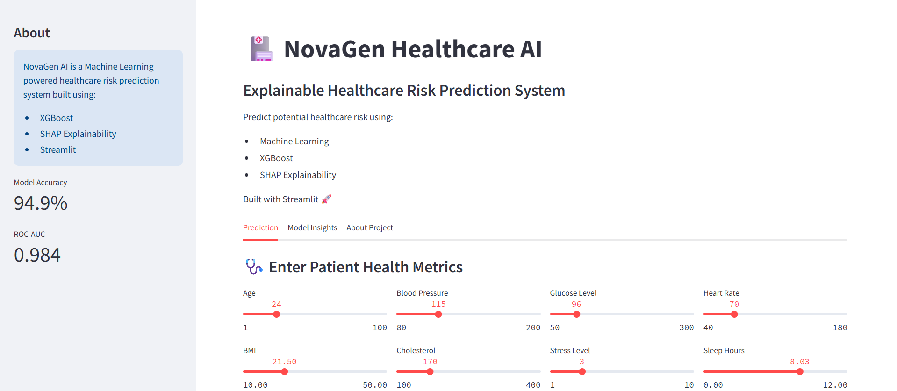
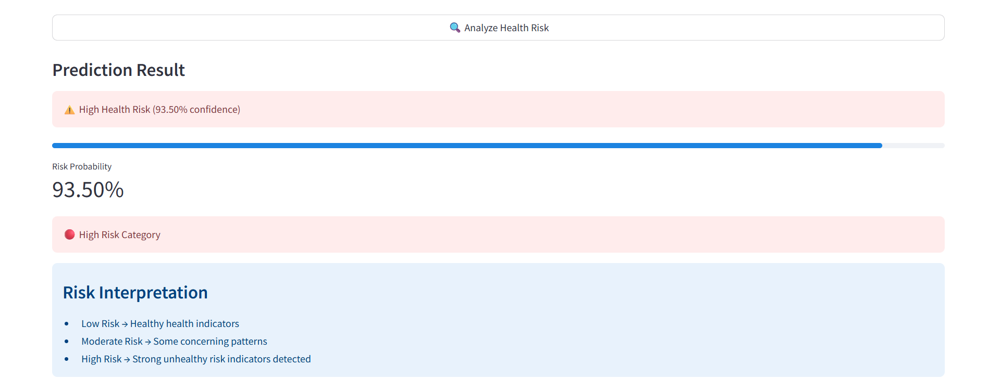
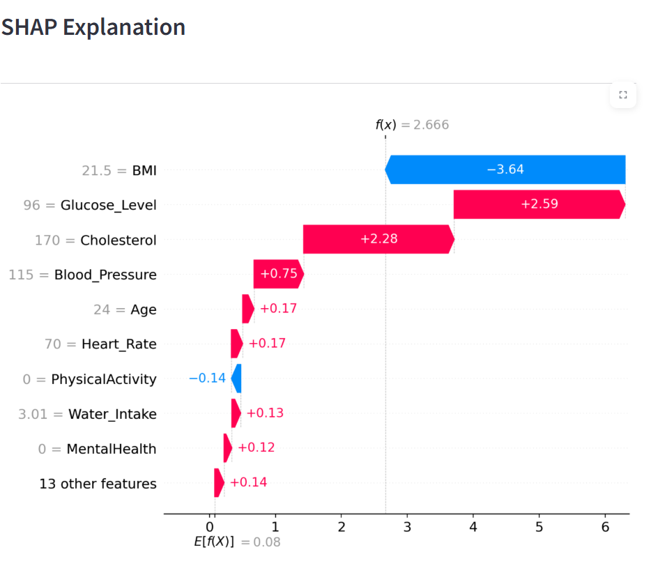
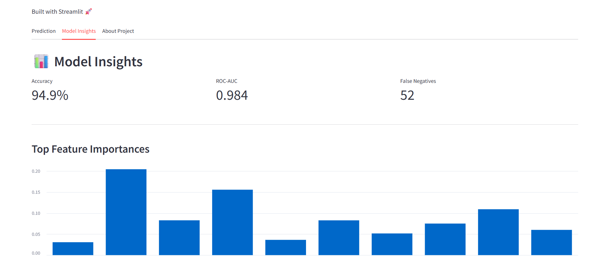

# NovaGen Healthcare AI

An end-to-end Machine Learning healthcare risk prediction system built using ensemble learning, explainable AI (SHAP), Streamlit deployment, and GitHub integration.

---

# Live Demo

Streamlit App:
https://novagen-healthcare-ai-4hzhrtehjapeugpjyxuef4.streamlit.app/

---

# Project Overview

NovaGen Research Labs conducts large-scale population health studies to identify individuals who may be at higher health risk based on medical and lifestyle indicators.

The objective of this project is to develop a Machine Learning classification system capable of predicting whether an individual is "Healthy" or "Unhealthy" using healthcare-related attributes such as BMI, blood pressure, cholesterol, stress levels, sleep habits, and lifestyle indicators.

This project demonstrates:

- Exploratory Data Analysis (EDA)
- Ensemble Learning
- Hyperparameter Tuning
- Explainable AI using SHAP
- Streamlit Deployment
- GitHub Version Control

---

# Dataset Features

The dataset contains healthcare-related features such as:

- Age
- BMI
- Blood Pressure
- Cholesterol
- Glucose Level
- Heart Rate
- Sleep Hours
- Exercise Hours
- Water Intake
- Stress Level
- Smoking
- Alcohol Consumption
- Diet
- Mental Health
- Physical Activity
- Medical History
- Allergies

Target Variable:

- 0 → Healthy
- 1 → Unhealthy

---

# Machine Learning Workflow

The project workflow included:

1. Data Cleaning and Exploration
2. Exploratory Data Analysis (EDA)
3. Correlation Analysis
4. Baseline Model Training
5. Ensemble Learning
6. Hyperparameter Tuning
7. SHAP Explainability
8. Streamlit Deployment

---

# Models Used

The following Machine Learning models were trained and evaluated:

- Logistic Regression
- Decision Tree
- Random Forest
- AdaBoost
- Gradient Boosting
- XGBoost

---

# Final Model Performance

The tuned XGBoost classifier achieved the best overall performance.

## Final Metrics

- Accuracy: 94.86%
- Precision: 95%
- Recall: 95%
- F1-Score: 95%

Confusion Matrix:

| Actual / Predicted | Healthy | Unhealthy |
| ------------------ | ------- | --------- |
| Healthy            | 854     | 46        |
| Unhealthy          | 52      | 958       |

---

# SHAP Explainability

SHAP (SHapley Additive exPlanations) was used to interpret model predictions and understand feature importance.

Key findings:

- BMI was the strongest predictor of health risk.
- Blood Pressure and Cholesterol significantly influenced predictions.
- Stress Level also demonstrated meaningful contribution.

---

# Streamlit Application Features

The deployed Streamlit application includes:

- Interactive health input interface
- Real-time healthcare risk prediction
- Prediction probability output
- SHAP explainability visualization
- User-friendly interface

---

# Applicatoin Preview

## Home Page



---

## Prediction Result



---

## SHAP Explainability



---

## Model Insights



---

# Project Structure

```bash
Novagen-Healthcare-AI/
│
├── app/
│   └── app.py
│
├── data/
│   └── novagen_dataset.csv
│
├── models/
│   ├── health_risk_model.pkl
│   └── model_features.pkl
│
├── notebooks/
│   ├── 01_data_understanding.ipynb
│   └── 02_model_.ipynb
│
├── README.md
├── requirements.txt
├── .gitignore
```

---

# Installation

Clone the repository:

```bash
git clone https://github.com/kaushikgopi0724/Novagen-Healthcare-AI.git
```

Move into project directory:

```bash
cd Novagen-Healthcare-AI
```

Install dependencies:

```bash
pip install -r requirements.txt
```

Run Streamlit app:

```bash
streamlit run app/app.py
```

---

# Future Improvements

Potential future enhancements include:

- Deep Learning integration
- Real healthcare dataset integration
- Docker deployment
- Cloud deployment using AWS/GCP
- User authentication system
- Advanced dashboard analytics

---

# Author

Kaushik Gopi

GitHub:
https://github.com/kaushikgopi0724

---

# Acknowledgements

This project was developed as part of a Machine Learning assignment focused on healthcare risk prediction using supervised learning and ensemble techniques.
